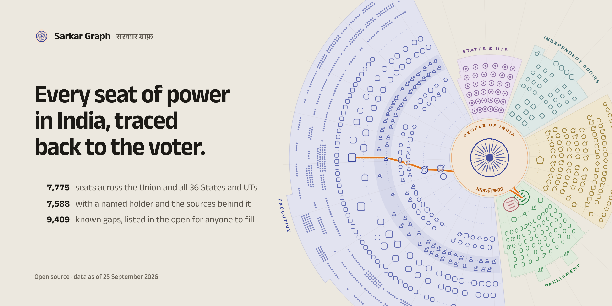
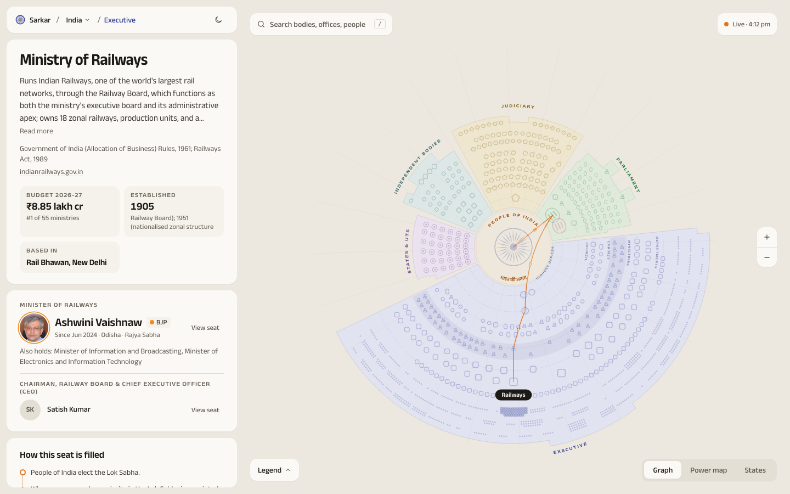

<picture>
  <source media="(prefers-color-scheme: dark)" srcset="docs/img/banner-dark.png">
  
</picture>

# Sarkar Graph

**Every seat of power in India, traced back to the voter.** → **[sarkargraph.vercel.app](https://sarkargraph.vercel.app)** · [launch film](https://github.com/divyanshgandhi/sarkar-graph/releases/tag/v0.1.0)

An open, live map of the Government of India: the Union, Parliament, the courts, constitutional bodies and regulators, and all 36 States and Union Territories — who holds each seat, who put them there, whom they answer to, and what changed this week.



The People sit at the centre as an Ashoka Chakra. Every office, court and commission is placed by its distance from the voter. Select any seat and the wheel turns until it rests at the foot, then draws its chain of authority back to the People in saffron: *the People elect the Lok Sabha → whoever commands its majority is appointed Prime Minister → the Minister is appointed on the PM's advice → the Minister heads the Ministry.*

Inspired by CivLab's [US Gov Graph](https://graph.civlab.org/us). Built from public sources, by and for citizens.

## What's in it today

| | |
|---|---|
| Governments | Union + all 36 States / UTs, each with its own wheel |
| Seats mapped | 7,775 (7,588 with a named holder) · 6,407 distinct people |
| Parliament | all 543 Lok Sabha and 245 Rajya Sabha seats, 63 committees |
| States | Governor/LG, CM, every minister, Speaker, LoP, Chief Secretary, DGP, ~4,100 MLAs/MLCs, departments, districts, municipal corporations |
| Union | 53 ministries, 54 departments, ~530 attached/autonomous bodies, 158 PSUs & banks, 99 courts & tribunals, 39 constitutional bodies & regulators |
| Money | Union Budget 2026–27, every ministry's demand, top schemes, tax devolution to States |
| Live | news from 7 Indian feeds tagged to bodies and people, a 90-day "who's in the news" power map over ~26,000 articles, a change log of appointments |

What we have — and, just as important, **what we don't** — is listed in [`docs/DATA_COVERAGE.md`](docs/DATA_COVERAGE.md) and machine-readably in [`exports/gaps.csv`](exports/gaps.csv) (9,400+ typed gaps, each with how to help).

## Accuracy first

- Every office-holder carries sources and an as-of date. Uncertain entries are shown as *not yet verified* on the map.
- Each research segment was built by one agent and re-checked by an independent adversarial verifier against 2025–26 sources; a stratified accuracy audit measures the error rate ([`research/india/ACCURACY_AUDIT.md`](research/india/ACCURACY_AUDIT.md)).
- Fixes never overwrite the research silently: they go into [`data/corrections/`](data/corrections/) with a source, reason, author and date, and are applied at build time.
- Much of the roster was seeded from Wikipedia. Replacing that with primary sources (Gazette, official portals, ECI, sansad.in, assembly sites) is the biggest open accuracy task — see [`docs/SOURCING_POLICY.md`](docs/SOURCING_POLICY.md).
- Politically neutral by design: no party gets a privileged colour or position; party colours appear only where party is the data.

## Run it

```bash
pnpm install          # pnpm 11; only versions public for 7+ days; no dependency build scripts
pnpm graph            # data/raw/*.json (+ data/corrections) → public/data/graph/*.json, search, people, change log
pnpm ingest           # pull the live news feeds into the local archive
pnpm dev              # http://localhost:5190
```

| Script | What it does |
|---|---|
| `pnpm images` | fetch portraits from Wikipedia for every office-holder with a page |
| `pnpm export` | regenerate `exports/people.csv`, `exports/sources.csv`, `exports/gaps.csv`, `docs/DATA_COVERAGE.md` |
| `pnpm check:layout` | prove no two marks overlap on any of the 37 wheels (run before every PR) |
| `pnpm coverage` | per-State coverage and integrity report |
| `pnpm shoot <url> <out.png> <w> <h> <scale>` | deterministic screenshots over the DevTools protocol |
| `node --experimental-strip-types scripts/ingest-news.ts --backfill 90` | rebuild the 90-day news archive |

## How it works

| Layer | Where | |
|---|---|---|
| Research | `data/raw/<segment>.json` | One file per slice of the state, schema in [`research/india/SCHEMA.md`](research/india/SCHEMA.md) |
| Corrections | `data/corrections/*.json` | Sourced, dated overrides applied on top of research |
| Compile | `scripts/build-graph.ts` | Merge, ownership rules, sectors/tiers/shapes, the constitutional backbone (Arts. 54, 66, 75, 81, 155, 164, 170), budgets, portraits, change log |
| Layout | `src/lib/layout.ts` | Overlap-free by construction: per-wedge concentric tracks, a 1-D least-squares packer with minimum gaps, dot blocks for small bodies |
| Map | `src/components/wheel` | SVG; spring turn to 6 o'clock; saffron chain of authority; upright glyphs; layer toggles; pinch/zoom |
| Live | `src/lib/server/*`, `/api/live`, `/api/live/stream` | RSS + archive, deterministic entity/person tagger (no LLM key needed), power map (heat = recent ÷ total × 90/7), pushed over server-sent events |

Stack: Next.js 16, React 19, Motion 13, Tailwind 4, TypeScript. Type: Anek Latin + Anek Devanagari (Ek Type). Design system: [`DESIGN.md`](DESIGN.md).

## Contribute

We need data stewards for every State, source adapters, verifiers, translators for Indian languages, designers and engineers. Start with [`CONTRIBUTING.md`](CONTRIBUTING.md), pick a gap from [`exports/gaps.csv`](exports/gaps.csv), and read the direction in [`docs/VISION.md`](docs/VISION.md) and [`docs/ROADMAP.md`](docs/ROADMAP.md).

## Privacy

Visitor counts come from Vercel Web Analytics: cookieless, no personal data, no tracking across sites.

## Licence

Code: [MIT](LICENSE). Data: [CC BY 4.0](LICENSE-DATA) — reuse it freely with credit. Details in [`LICENSING.md`](LICENSING.md).
